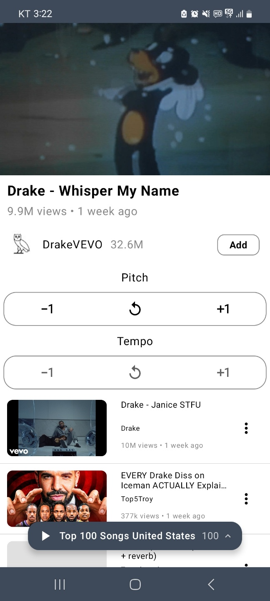
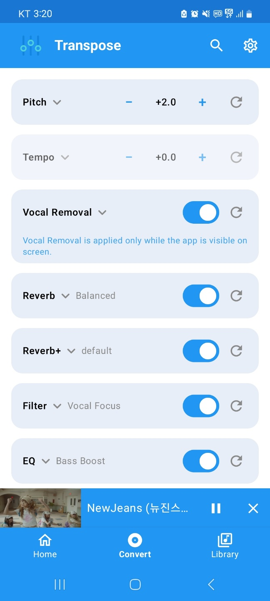
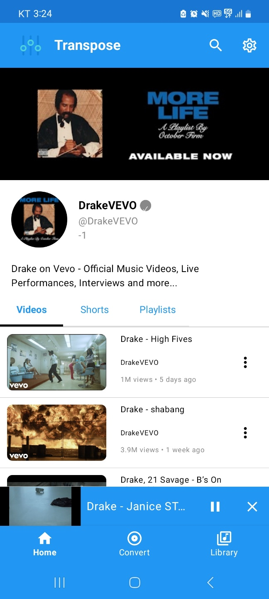

# Transpose

YouTube 영상을 보면서 피치, 보컬, 리버브, EQ를 실시간으로 조절해보세요.

Transpose는 Android에서 YouTube 영상을 재생하는 동안 피치 조절, 보컬 제거, 보컬만 듣기, 리버브, 필터 같은 음향 효과를 바로 적용할 수 있는 오픈소스 앱입니다.

따로 파일을 변환하거나 내보낼 필요 없이, 듣는 중에 원하는 소리로 바로 바꿀 수 있습니다.

[English version (영어 버전)](README.md)

## 다운로드

최신 APK는 [GitHub Releases](https://github.com/joh9911/Transpose_Compose/releases)에서 다운로드할 수 있습니다.

데스크톱에서도 같은 실시간 음향 효과를 사용하고 싶다면 [Chrome Web Store에서 Transpose Live](https://chromewebstore.google.com/detail/transpose-live-real-time/kieeaonfgnemfoimiiighmmajeihggcj)를 설치할 수 있습니다.

## 스크린샷

| 재생 화면 | 음향 효과 | 채널 |
|:---------:|:---------:|:----:|
|  |  |  |

## 핵심 기능

### YouTube 재생 중 실시간 음향 효과

YouTube 영상을 재생하면서 다음 효과를 바로 적용할 수 있습니다.

- 피치 조절
- 실시간 보컬 제거
- 목소리만 듣기
- 리버브
- 리버브+
- 필터
- 코러스
- 이퀄라이저

실시간 보컬 제거는 지원되는 64비트 기기에서 사용할 수 있습니다. 앱이 화면에 표시되는 동안 적용되며, 안정적인 재생을 위해 백그라운드에서는 자동으로 꺼집니다.

## YouTube 재생

앱 안에서 YouTube 콘텐츠를 검색하고 재생할 수 있습니다.

- YouTube 영상 검색
- 재생목록 재생
- 관련 영상
- 백그라운드 재생
- 미디어 알림 컨트롤
- 영상 화질 선택
- 개인 재생목록

## 지원 기기

- Android 7.1 이상
- ARM64 Android 기기 권장
- 실시간 보컬 제거는 지원되는 64비트 기기에서 사용 가능
- 안정적인 실시간 보컬 처리를 위해 최근 중급기 이상 또는 플래그십 기기 권장

일반 재생과 기본 음향 효과는 보컬 제거보다 가볍습니다. 보컬 제거는 가장 CPU 사용량이 높은 기능이며, CPU 성능, 발열 상태, 현재 시스템 부하에 따라 품질과 안정성이 달라질 수 있습니다.

## 라이선스

이 프로젝트는 GPL-3.0 라이선스를 따릅니다. 자세한 내용은 `LICENSE` 파일을 참조해주세요.

## 면책 조항

이 프로젝트는 YouTube 또는 그 계열사, 자회사와 어떠한 제휴, 보증, 후원 관계도 없습니다. 이 프로젝트에서 사용된 모든 상표와 지적 재산권은 각 소유자의 자산입니다.

## 연락처

조성민 (Sungmin Joh) - joh99111@gmail.com
