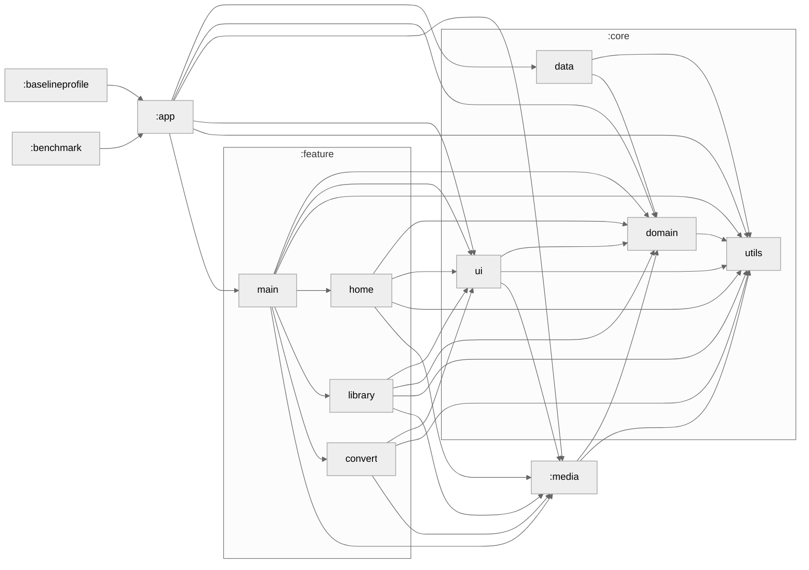

### Module Graph

```mermaid
%%{
  init: {
    'theme': 'neutral'
  }
}%%

graph LR
  subgraph :core
    :core:ui["ui"]
    :core:utils["utils"]
    :core:data["data"]
    :core:domain["domain"]
  end
  subgraph :feature
    :feature:convert["convert"]
    :feature:home["home"]
    :feature:library["library"]
    :feature:main["main"]
  end
  :feature:convert --> :core:ui
  :feature:convert --> :core:utils
  :feature:convert --> :media
  :core:data --> :core:utils
  :core:data --> :core:domain
  :feature:home --> :core:domain
  :feature:home --> :core:ui
  :feature:home --> :core:utils
  :feature:home --> :media
  :feature:library --> :core:ui
  :feature:library --> :core:domain
  :feature:library --> :core:utils
  :feature:library --> :media
  :core:ui --> :core:domain
  :core:ui --> :core:utils
  :core:ui --> :media
  :core:domain --> :core:utils
  :media --> :core:domain
  :media --> :core:utils
  :app --> :core:data
  :app --> :core:domain
  :app --> :media
  :app --> :core:ui
  :app --> :core:utils
  :app --> :feature:main
  :feature:main --> :core:domain
  :feature:main --> :core:ui
  :feature:main --> :core:utils
  :feature:main --> :feature:home
  :feature:main --> :feature:library
  :feature:main --> :feature:convert
  :feature:main --> :media
  :baselineprofile --> :app
  :benchmark --> :app
```